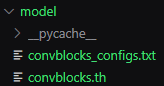

# Image Multi-Class Models
### _Description_
> Convolutional and Transformer networks  
> for image multi-class classification use. 


## Installation
### Dataset
Download and use any [image classification dataset][online_datasets] desired. Reference the Dataset Structure section for more information.

[Go to Dataset Structure section](#dataset-structure)

Note: _makes sure the dataset directory follows the following structure and naming convention:_


### Requirements
Install requirements for pytorch and other imports:
```sh
pip install -r requirements.txt
```

## Model Architecture
### Convblocks 
> _ConvolutionalBlockNet_

Model that consists of 'blocks' which contains several convolutions.
#### Parameters:
- _num_layers_: number of 'blocks' to use

#### Convblocks Architecture:

> Note: _image of architecture is from Tensorboard logger_

### [Unet][unet]
> _ConvolutionalUNet_

Based on U-Net architecture, model that consists of a series of 'down' and 'up' convolutions.

#### [Unet Architecture:][unet_pic]


### [ViT][vit]
> _TransformerNet_

Based on ViT architecture, transformer model that consists of a positional encoding and serveral transformer layers that contain multi-head attention with a 'mlp' linear transformation.
#### Parameters:
- _num_layers_: number of transformer layers
- _num_heads_: number of attention heads

#### [ViT Architecture:][vit_pic]


## Dataset Structure
### Structure
During the data processing phase, the ImageFolder class requires the dataset structure to be the following way:
> _data/type_of_data/class_name/image.jpg_

> Therefore, any dataset can be utilized to train these models, provided it adheres to the specified structure for the three 'types_of_data' categories --- training, validation, and testing --- with images appropriately organized within their respective 'class_name' directories.


[Go back to Installation](#installation)

The [Brain Tumor MRI Dataset][dataset] was used for this example for training and testing the performance of these models.
The Brain Tumor dataset has 4 classes:
- glioma
- meningioma
- notumor
- pituitary

### Distribution
> The dataset is distributed using a 80/20 Train-Test Split. 
> 20% of the training dataset is used for validation. 

The following displays the distribution for the Brain Tumor MRI Dataset:


## Training
To train model, execute:
```sh
python -m model.train --model_name [ convblocks | unet | vit ]
```
Printouts for every epoch will display in terminal:


For optional hyperparameters:
```sh
--num_epochs [ int ]        # Number of epochs to train
--batch_size [ int ]        # Batch size for training
--learning_rate [ float ]   # Learning rate for optimizer (AdamW)
--weight_decay [ float ]    # Weight decay for optimizer (AdamW)
--num_workers [ int ]       # Number of workers for data loading
```
For optional model parameters:
```sh
--image_size [ int ]    # Size of image
--num_layers [ int ]    # Number of layers in model
--num_heads [ int ]     # Number of heads for attention
--with_weights [ bool ] # Load model weights
```
To change Tensorboard logging directory name:
```sh
--log_dir [ str ]    # Name of directory to save logs
```
At the end of training, two files will output inside the model directory:
- _model_name.th_ : weights of trained model
- _model_name_configs.txt_ : parameters of trained model



### Tensorboard
To run Tensorboard, execute on a separate terminal during training:
```sh
tensorboard --log_dir [ name_of_logging_directory ]
```
Using Tensorboard helps view training in localhost.


## Testing 
To test model, execute:
```sh
python -m model.test --model_name [ convblocks | unet | vit ]
```
For optional data parameters:
```sh
--image_size [ int ]        # Size of image
--batch_size [ int ]        # Batch size for data loading
--num_workers [ int ]       # Number of workers for data loading
```
At the end of testing, the models accuracy will output to the terminal.


## Performance 
The following default parameters were used to test the performance of the models:
```sh
--num_epochs 60
--batch_size 32
--learning_rate 0.001
--weight_decay 1e-4
--num_workers 4
--image_size 128
--num_layers 3
--num_heads 4
```

#### Model Color Scheme


### During Training 


### Validation


### Results
The following accuracies were achieved:

| Model       | Accuracy |
|-------------|----------|
| Convblocks  | 94.20%   |
| Unet        | 94.43%   |
| ViT         | 88.86%   |


[//]: # (References)
   [unet]: <https://arxiv.org/abs/1505.04597>
   [unet_pic]: <https://lmb.informatik.uni-freiburg.de/people/ronneber/u-net/>
   [vit]: <https://arxiv.org/abs/2312.01232>
   [vit_pic]: <https://www.geeksforgeeks.org/vision-transformer-vit-architecture/>
   [dataset]: <https://www.kaggle.com/datasets/masoudnickparvar/brain-tumor-mri-dataset/data?select=Testing>
   [online_datasets]: <https://www.kaggle.com/datasets?tags=16686-Image+Classification>
